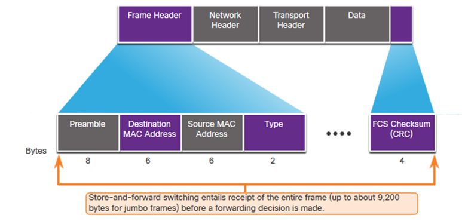
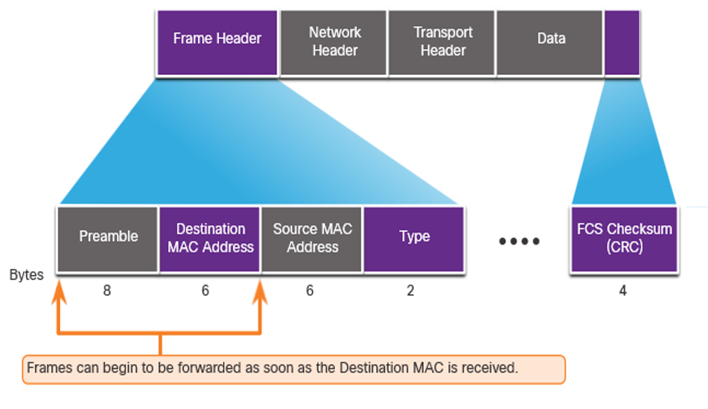
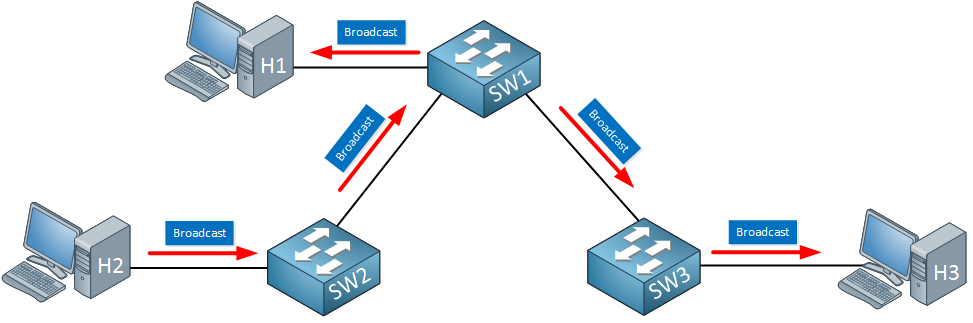

# Module 2: Switching Concepts

## Frame forwarding

- Ingress port: Port where the frame enters the switch
- Egress port: Port where the frame exits the switch

Switch forwards based on the **ingress port** and the **destination MAC address**.
Using its MAC address table, A table that maps MAC addresses to ports.

**A Frame will never be forwarded out the ingress port.**

A switch builds a MAC address table, also known as a Content Addressable Memory (CAM) table, by recording the source MAC address into the table along with the port it was received.

2 Steps:

1. **Learning**: When a frame enters a switch, the switch learns the source MAC address and the port it was received on.
   - If the source address is not in the table it will add it
   - If it was in the table it will reset the timer.
2. **Forwarding**: When a frame enters a switch, the switch looks up the destination MAC address in the MAC address table and forwards the frame out the appropriate port.
   - If the destination MAC address is not in the table, the switch floods the frame out all ports except the ingress port.

**Store-and-forward** switches store the entire frame before forwarding it. This allows the switch to check the frame for errors before forwarding it.(CRC check on the Frame Check Sequence (FCS) field)

    - Allows for buffering and error checking

**Cut-through** switches forward the frame as soon as the destination MAC address is read. This reduces latency but does not allow for error checking.

    - Ensures fragment free: Check that the frame is at least 64 bytes long before forwarding it.
    - Does not support ports with different speeds

## Switching domains

Full Duplex -> Collision domains are eliminated

Half Duplex -> Collision domains are created

Most devices have auto-negotiation enabled by default, which allows them to negotiate the best speed and duplex mode.

**Broadcast domain**: Extends across all layer 1 and layer 2 devices that are connected on a lan

When the layer 2 switch receives the broadcast it will flood it out all interfaces except for the ingress interface.

Too many broadcasts may cause congestion and poor network performance.

Only a layer 3 device (router) will break the broadcast domain, also called a MAC broadcast domain.

So a broadcast does not go through a router.

