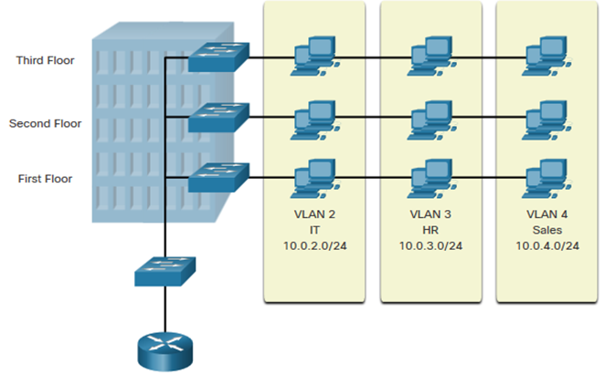
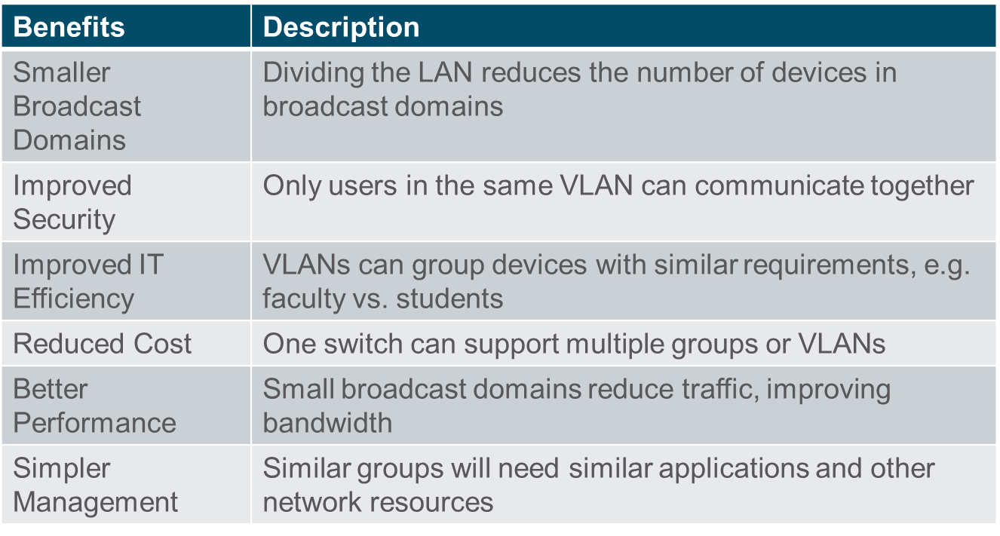
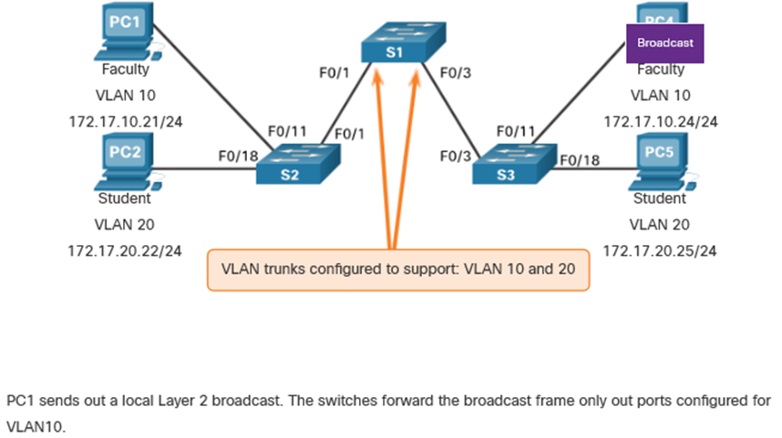
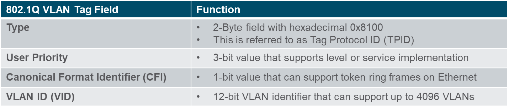
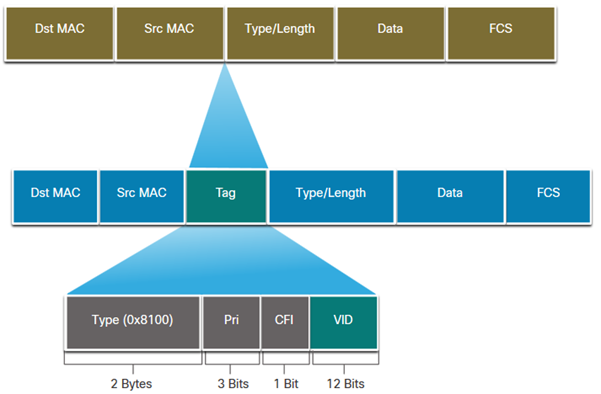
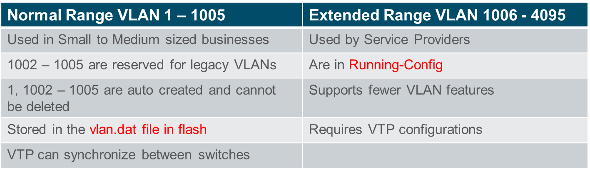
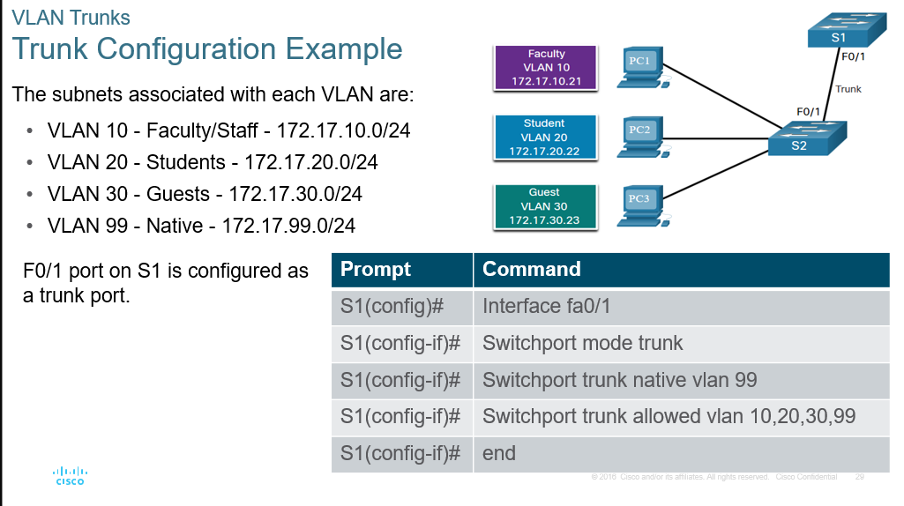
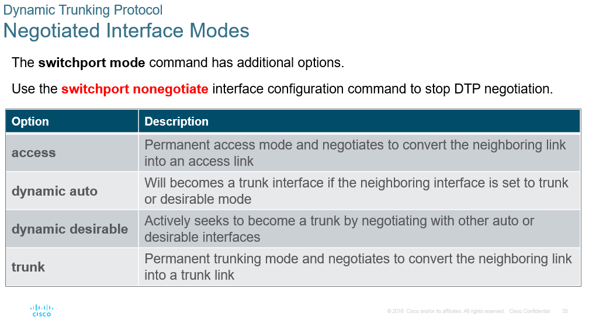

# Module 3: VLANs

## Overview of VLANS

**VLANS allow a single switch to act as multiple virtual switches.** This allows for the separation of broadcast domains and the ability to segment traffic.

e.g. this allows a single switch to have multiple LANs, witch each a different IP range.

Types of VLANs:

- **Default VLAN**: VLAN 1 is the default VLAN on all switches. All ports are members of VLAN 1 by default. Default management VLAN, default Native VLAN, cannot be deleted.
- **Data VLAN**: Used to carry user-generated traffic. This is the VLAN that carries the data traffic for the users.
- **Native VLAN**: The Native VLAN is used for untagged traffic. This is the VLAN that carries the untagged traffic. All frames on a trunk link are tagged except for frames on the Native VLAN. Untagged frames are frames that do not have a VLAN tag.

  > **Untagge frame:** If however for some reason, there is no tag on a frame that is received, the switch must know what to do with it. The Native VLAN configuration essentially tells the switch on which VLAN any untagged frames should be placed.

- **Management VLAN**: Used for managing the switch. This is the VLAN that carries the management traffic for the switch. Typicaly this is the SVI VLAN. SSH connections.
- **Voice VLAN**: Used to carry voice traffic. This is the VLAN that carries the voice traffic for VoIP phones. Voice has a seperate VLAN to ensure quality of service and bandwidth.

## VLANs in a Multi-Switch Environment

A TRUNK is a point-to-point link between two network devices that carries more than one VLAN. Trunks carry traffic for multiple VLANs over a single link. Extend VLANs across multiple switches.

Without VLANs, all devices connected to the switch are in the same broadcast domain. With VLANs, you can segment the network into multiple broadcast domains. So for example if a device sends a unicast, broadcast or multicast frame, it will only be sent to the devices in the same VLAN.

VLANs are identified by a VLAN Tag on the frame.

When a tag gets added to a frame the FCS (Frame Check Sequence) is recalculated.

When sent to end devices, this tag must be removed and the FCS recalculated back to its original number.

IEEE 802.1Q header is 4 bytes

## VLAN Configuration

## VLAN Trunks

**dot1q** is the most common trunking protocol.

## Dynamic Trunking Protocol (DTP)

Cisco prooruetary protocol that negotiates the trunking mode between two switches.

Can be turened off with the `switchport nonegotiate` command.

`show dtp interface <interface>`

Best practice recommends that the interfaces be set to access or trunk and to **turnoff DTP**
