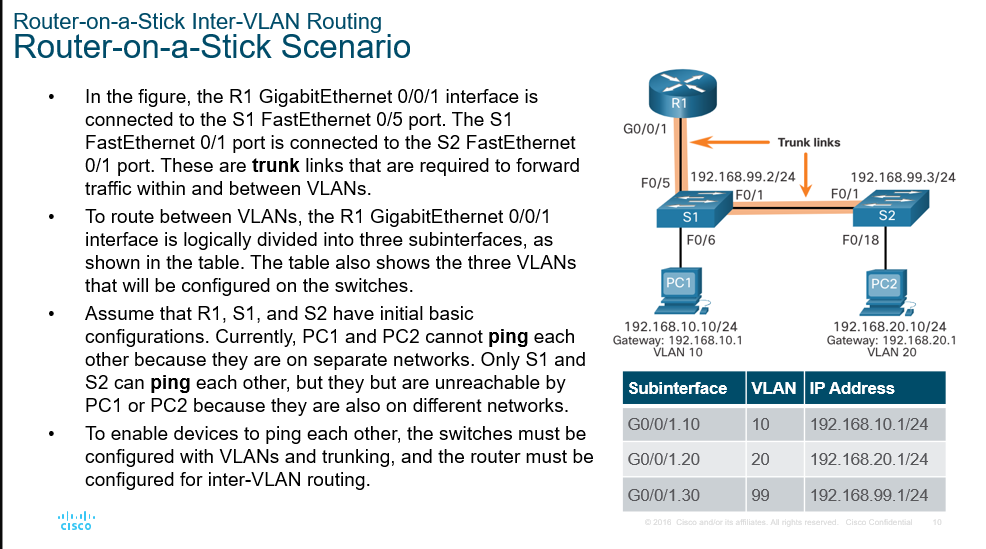

# Module 4: Inter-VLAN Routing

## Inter-VLAN Routing Operation

VLANs cannot talk to each other by default. A router is needed to route traffic between VLANs. This is called Inter-VLAN routing.

Three inter-VLAN routing options:

- Legacy Inter-VLAN routing - This is a legacy solution. It does not scale well.

> This works by using multiple ethernet interfaces on a router. Each interface is assigned to a different VLAN. The router then routes traffic between the VLANs. This is not a scalable solution since it requires a separate interface for each VLAN.

- Router-on-a-Stick - This is an acceptable solution for a small to medium-sized network.

> This works by using a single ethernet interface on a router. The interface is configured as a trunk link. So the trunk carries multiple VLANs. Then subinterfaces are created on the router. Each subinterface is assigned to a different VLAN. Not scalable beyond 50 VLANs.

- Layer 3 switch using switched virtual interfaces (SVIs) - This is the most scalable solution for medium to large organizations.

> Modern method to use Layer 3 Switches and SVI interfaces. This is the most scalable solution. The switch can route traffic between VLANs without the need for a router.

Advantages of Layer 3 switches:

- They are much **faster** than router-on-a-stick because everything is hardware switched and routed.
- There is **no need for external links** from the switch to the router for routing.
- They are **not limited to one link** because Layer 2 EtherChannels can be used as trunk links between the switches to increase bandwidth.
- **Latency is much lower** because data does not need to leave the switch in order to be routed to a different network.
- They **more commonly deployed** in a campus LAN than routers.
- The only disadvantage is that Layer 3 switches are **more expensive**.

## Router-on-a-Stick Inter-VLAN Routing

## Inter-VLAN Routing using Layer 3 Switch

A Layer 3 SVI must be created for each of the routable VLANs.

## Troubleshooting Inter-VLAN Routing

First check physical layer issues

When a VLAN is deleted, any ports assigned to that VLAN become inactive. They remain associated with the VLAN (and thus inactive) until you assign them to a new VLAN or recreate the missing VLAN. Recreating the missing VLAN would automatically reassign the hosts to it.

Devices correct ip address and subnet mask and default gateway.

Not have enable routing on the router.
