# Module 5: STP concepts

## Purpose of STP

**Spanning Tree Protocol (STP)** is a Layer 2 protocol that runs on bridges and switches. The main purpose of STP is to ensure that you do not create loops when you have redundant paths(Addition of physical paths) in your network. Loops are deadly to a network. When a loop occurs, the network will be flooded with broadcast packets, which will eventually bring the network to a standstill.

Spannig Tree Protocol creates a loop-free redundant layer 2 network.

When failures occur in the network, STP will automatically reconfigure the network to allow for the traffic to go over a previously blocked path. This is **STP recalculation**

Layer 2 loop issues:

- MAC address table instability / MAC database instability -> cannot deliver the packet to the correct destination
- Broadcast storm
  - Caused by ARP requests, DHCP requests, etc.
- link saturation
- High CPU utilization

TTL (Time to Live) is a mechanism to prevent the broadcast storm. When a packet is sent, it has a TTL value. When the packet reaches the TTL value, it is dropped.

STP is more specifically made to prevent loops in the network.

The Spanning Tree Algorithm (STA):
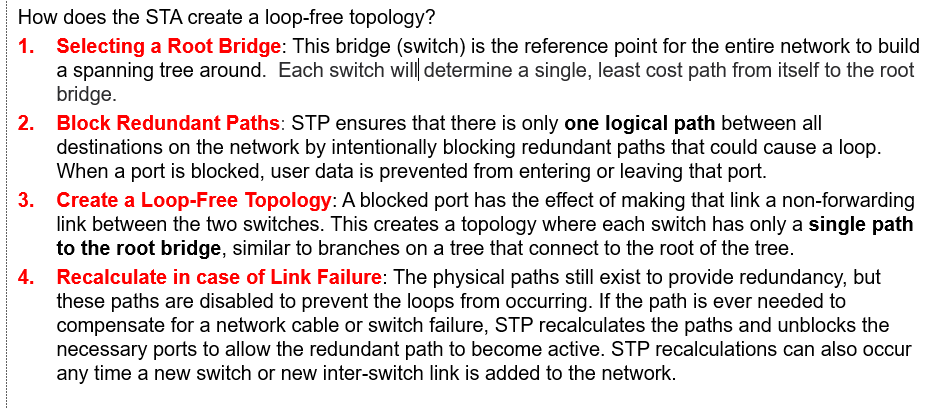

## STP Operations

**The bridge ID (BID)**:

- The bridge ID is a unique identifier for each bridge in the network.
- Consists of:
  - Priority
  - Extended system ID (VLAN ID)
  - MAC address -> used to break the tie when the priority is the same -> lower mac address wins

1 Deciding the root bridge:

- The bridge with the lowest bridge ID is elected as the root bridge.
- After startup each switch sends a BPDU with its BID and the root bridge ID.
- At first all switches think they are the root bridge.
- After receiving other BPDU messages, the switches compare the BID and the root bridge ID.

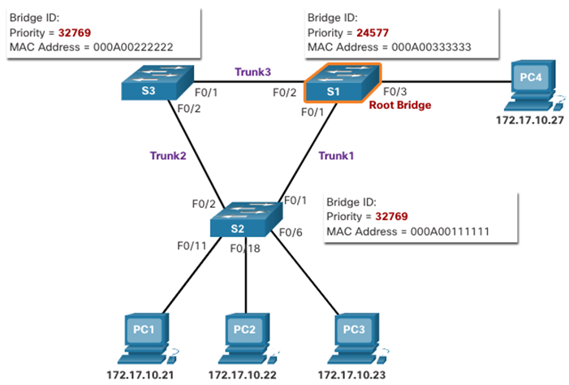

2 Selecting the root port:

- Internal root path cost -> total sum of all port costs from the switch to the root bridge

Port cost is calculated based on the bandwidth of the link. The lower the cost, the better the link.

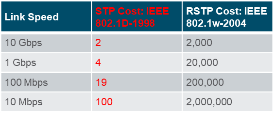

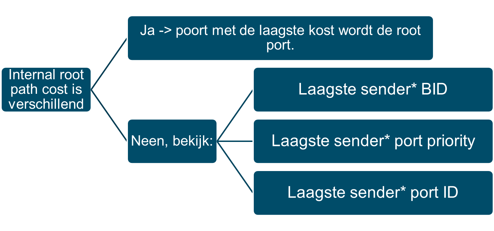

You have to sum up all the port costs of each switch to the root bridge.

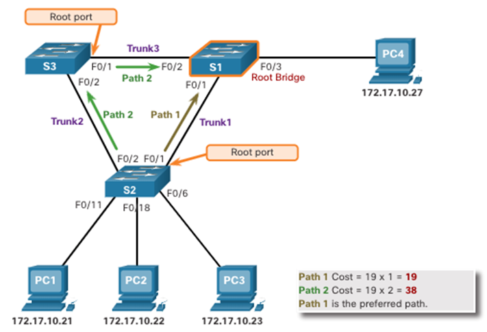

If cost is identical, the switch with the lower BID wins.

Identical cost and BID -> lowest port priority wins.

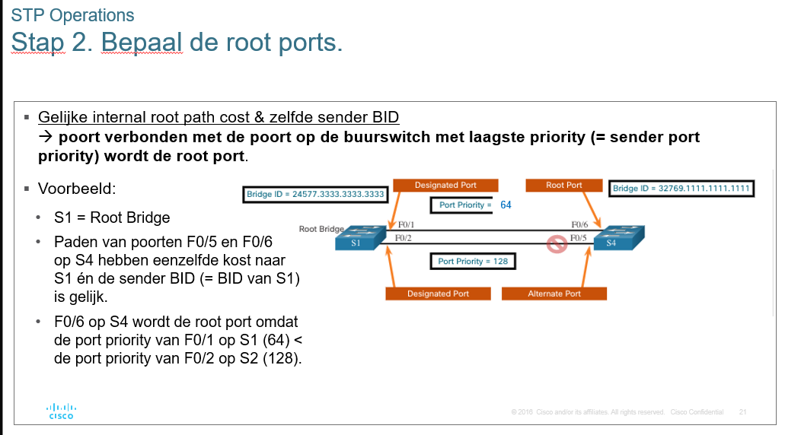

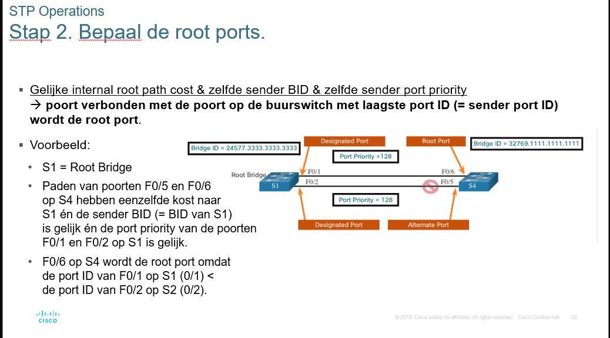

Deciding designated ports:

- All ports on the root bridge are designated ports.
- On other switches 1 designated port

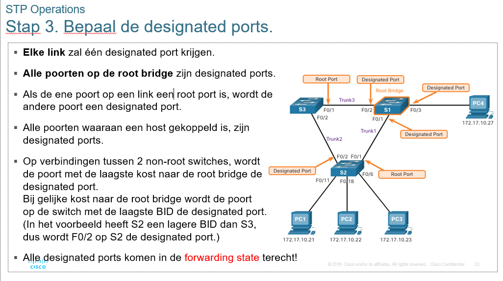

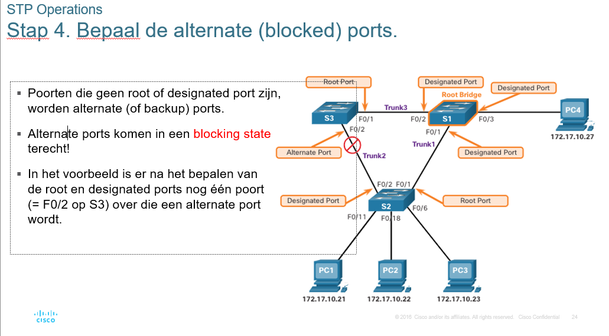

STP Timers:

- Hello time: 2 seconds
  - Time between BPDU messages
- Forward delay: 15 seconds
  - Time to wait before changing the port state
- Max age: 20 seconds

  - Time to wait before attempting to change the STP topology

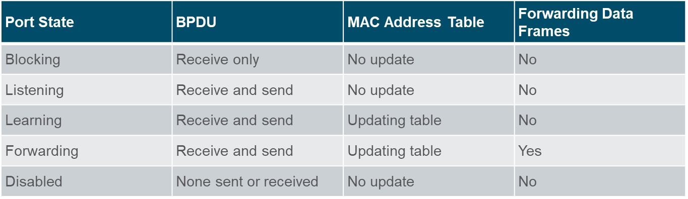

STP per VLAN:

- STP runs on a per VLAN basis
- Each VLAN has its own STP instance
- Each VLAN has its own root bridge

https://www.youtube.com/watch?v=6MW5P6Ci7lw

## Evolution of STP

STP refers to the various versions of the Spanning Tree Protocol.

The original version of STP was standardized as IEEE 802.1D. This version of STP is now considered legacy and has been replaced by the **Rapid Spanning Tree Protocol (RSTP)** and the **Multiple Spanning Tree Protocol (MSTP)**.

Cisco has also developed its own version of STP called **Per-VLAN Spanning Tree Protocol (PVSTP)** and **Per-VLAN Spanning Tree Protocol Plus (PVSTP+)**.

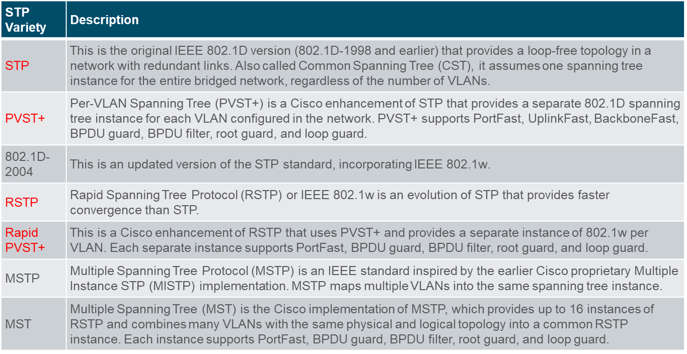

**RSTP** is an evolution of STP that provides faster convergence after a topology change. RSTP is defined in IEEE 802.1w.

Further a lot of bla bla about cisco proprietary stuff.
