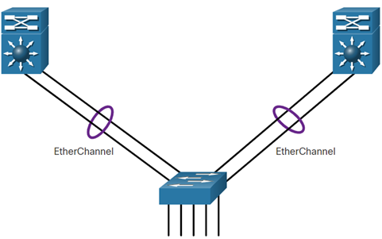
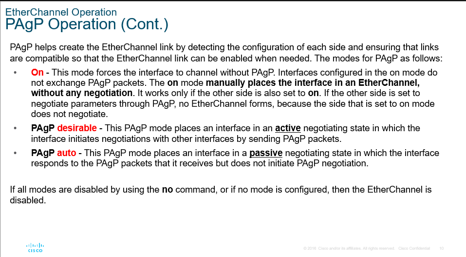
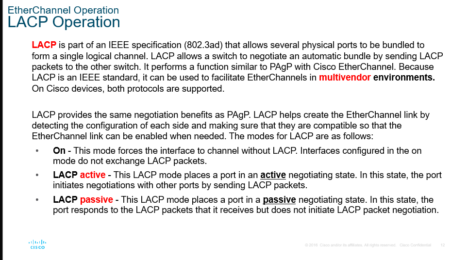
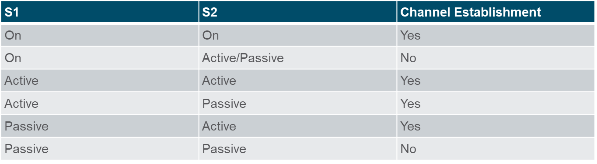

# Module 6: EtherChannel

## EtherChannel operation

Connecting multiple links between devices to increase bandwidth without proper configuration can lead to network loops. And STP will block some ports and eliminate the increased bandwidth.

**Link aggregation** is a method of combining multiple physical links into a single logical link to increase bandwidth and redundancy that will not be blocked by STP.

This is called EtherChannel. It groups **multiple physical links into a single logical link**.

Provides:

- Fault tolerance
- Load balancing
- Increased bandwidth
- Redundancy

The interface of a configured EtherChannel is called a **port channel** interface.

An etherchannel can be blocked by STP if there is a loop in the network. All physical interfaces in the etherchannel will be blocked.

Loss of a link in an EtherChannel does not cause a network loop because the other links in the EtherChannel continue to forward traffic.

Restrictions:

- All interfaces in the EtherChannel must be the same speed and duplex, vlan.
- Up to 8 Interfaces can be in an EtherChannel. (max 800Mbps with 100Mbps interfaces and 8Gbps with 1Gbps interfaces)
- Both ends of the EtherChannel must be configured with the same EtherChannel mode and settings.

Autonegotiation protocols:

- PAgP (Port Aggregation Protocol)
  - Cisco proprietary
  - Manages the EtherChannel if any changes are detected
- LACP (Link Aggregation Control Protocol)

## Configure EtherChannel

Cheatsheet

## Verify and troubleshoot EtherChannel

Ensure to configure the same settings on both ends of the EtherChannel.

Ensure to configure on the port-channel interface. Not on the physical interfaces. If there is a mismatch, the EtherChannel will not work.
