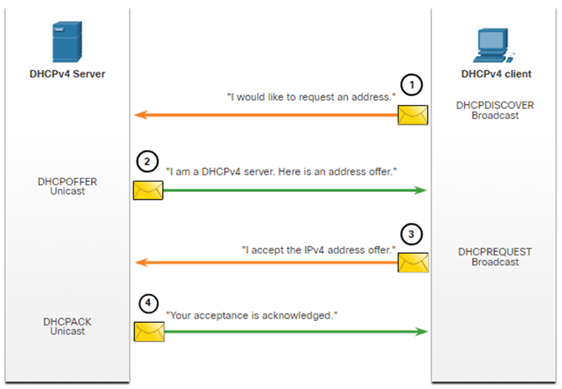
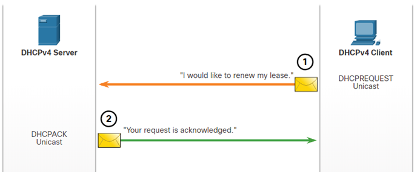
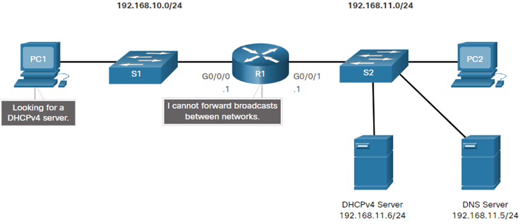
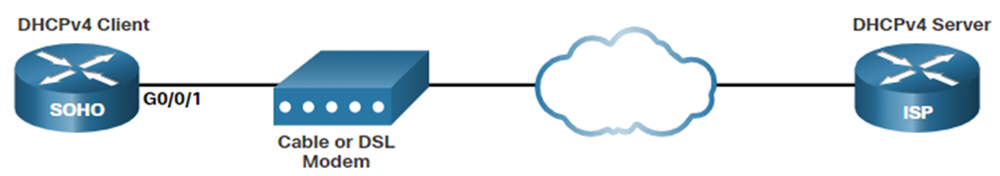

# Module 7: DHCPv4

## DHCPv4 Concepts

**Dynamic Host Configuration Protocol**

- DHCP is a protocol that provides a framework for passing configuration information to hosts on a TCP/IP network.

A DHCP server provides the following configuration information to a client:

- IP address
- Subnet mask
- Default gateway
- DNS server
- Domain name

A DHCP server is scalable and easy to manage.

The server leases an IP address to a client for a specific period of time.

Clients can renew their lease before the lease expires.

Or clients can request a new IP address.

If a lease expires it is returned to the pool of available addresses.

### DORA Process

1. **Discover**: The client broadcasts a DHCPDISCOVER message on the network to find a DHCP server.
2. **Offer**: The DHCP server responds with a DHCPOFFER message that includes an IP address and other configuration information.
3. **Request**: The client sends a DHCPREQUEST message to the server to request the offered IP address.
4. **Acknowledge**: The server sends a DHCPACK message to the client to confirm the lease of the IP address.

### Renew process

1. **Renew**: The client sends a DHCPREQUEST message to the server to renew the lease.
2. **Acknowledge**: The server sends a DHCPACK message to the client to confirm the lease renewal.

## Configuring a Cisco IOS DHCPv4 Server

Every cisco router can be configured as a DHCP server.

DHCP relay agent can be configured on a router to forward DHCP requests to a DHCP server.

Can also relay other network services like TFTP, DNS, etc.

## Configure a DHCPv4 Client

A router can have a DHCP client configured on an interface.

This is useful when the router is connected to an ISP.

WAN interfaces are usually configured as DHCP clients.
