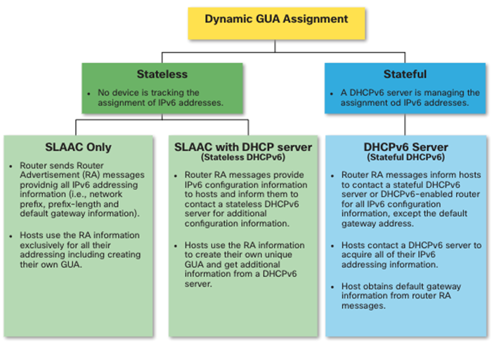
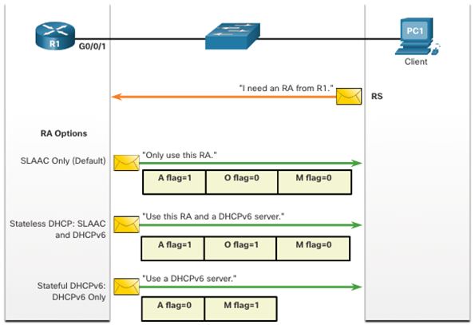

# Module 8: SLAAC and DHCPv6

## IPv6 GUA Assignment

Global Unicast Addresses (GUAs) are routable addresses that are used on the Internet. They are similar to public IPv4 addresses. GUAs are assigned by an ISP or a regional Internet registry (RIR). This is done by using DHCPv6 or SLAAC.

Link-local addresses are automatically assigned to an interface when IPv6 is enabled. These addresses are used for communication on the local link only. They are not routable.

The ICMPv6 RA message is used to assign a GUA to an interface. The RA message is sent by a router to all devices on the local link.

Flags in the RA message:

- **M flag**: Managed address configuration. If set, the host must use DHCPv6 to obtain an address.
- **O flag**: Other configuration. If set, the host must use DHCPv6 to obtain other configuration information.
- **A flag**: Autonomous address configuration. If set, the host can use SLAAC to obtain an address.

## **SLAAC**

- **Overview**:
  SLAAC enables devices to configure their IPv6 addresses automatically without the need for a DHCPv6 server. It relies on ICMPv6 Router Advertisement (RA) messages sent by routers.

- **Key Characteristics**:

  - **Stateless**: SLAAC does not maintain a record of address assignments, meaning there is no centralized control or tracking of IP addresses.
  - **Autoconfiguration**: Hosts generate their IPv6 address using the prefix provided in the RA message and combine it with their own interface ID.
  - **Flags in RA Messages**:
    - **A flag**: Indicates to use SLAAC to generate the IPv6 Global Unicast Address (GUA).
    - **O flag**: Indicates additional configuration (e.g., DNS servers) is available via a stateless DHCPv6 server.
    - **M flag**: Indicates that a stateful DHCPv6 server should be used instead of SLAAC.

- **Process**:

  1. Router sends periodic RA messages (or in response to Router Solicitation (RS) messages from hosts).
  2. Host uses the network prefix from the RA and generates the interface ID, either randomly or using EUI-64.
  3. The host ensures the address is unique via Duplicate Address Detection (DAD).
  4. The RA message provides the default gateway address (router’s link-local address).

- **Limitations**:
  - SLAAC does not provide other configuration parameters like DNS server information unless combined with stateless DHCPv6.

## **DHCPv6**

- **Overview**:
  DHCPv6 provides a more centralized and controlled mechanism for assigning IPv6 addresses and additional configuration parameters. It can operate in two modes: **stateless** and **stateful**.

- **Modes**:

  1. **Stateless DHCPv6**:

     - Provides configuration information (like DNS servers) without assigning an IP address.
     - The host generates its IPv6 address using SLAAC.
     - **RA flags**: A = 1 (SLAAC is used), O = 1 (indicates additional info is available from a DHCPv6 server).

  2. **Stateful DHCPv6**:
     - Assigns both IPv6 addresses and configuration information.
     - The server maintains a list of assigned IPv6 addresses (stateful).
     - **RA flags**: M = 1 (managed address configuration), A = 0 (SLAAC is disabled).

- **Process**:

  1. Host sends an RS message.
  2. Router responds with an RA message indicating the use of DHCPv6.
  3. Host sends a DHCPv6 SOLICIT message to locate a server.
  4. Server responds with an ADVERTISE message.
  5. Host requests the configuration with a REQUEST message.
  6. Server replies with the REPLY message, providing the necessary information.

- **Usage**:
  - Stateless DHCPv6 is often used alongside SLAAC.
  - Stateful DHCPv6 is used when full control over address assignment and tracking is needed.

---

### **Comparison**:

| Feature                  | SLAAC                             | Stateless DHCPv6          | Stateful DHCPv6           |
| ------------------------ | --------------------------------- | ------------------------- | ------------------------- |
| Address Assignment       | Host generates its own            | Host generates its own    | DHCPv6 server assigns     |
| Configuration Parameters | Not provided or limited (RA only) | Provided by DHCPv6 server | Provided by DHCPv6 server |
| Default Gateway          | Provided by RA                    | Provided by RA            | Provided by RA            |
| Centralized Control      | No                                | Partial                   | Yes                       |
| RA Flags                 | A = 1, O = 0, M = 0               | A = 1, O = 1, M = 0       | A = 0, O = 0, M = 1       |

Let me know if you want further details on the configuration or examples!

## Configure DHCPv6 Server

Cheatsheet
