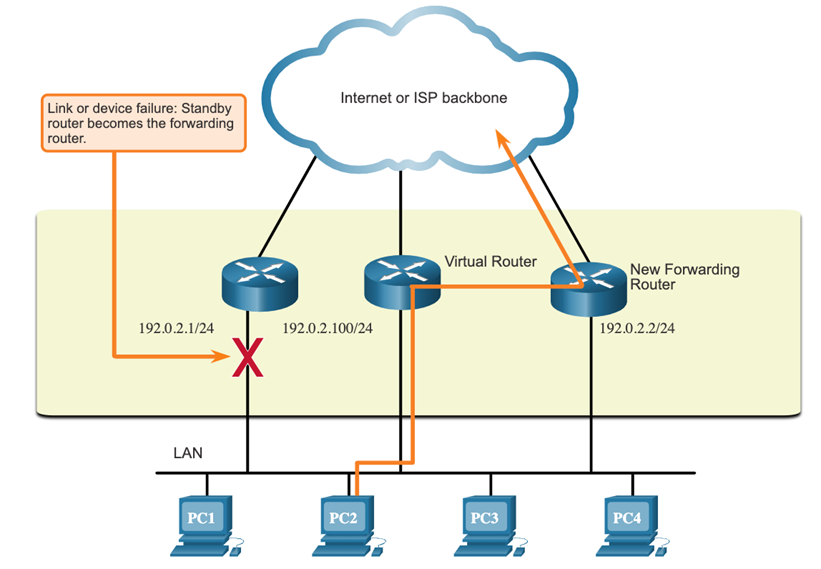
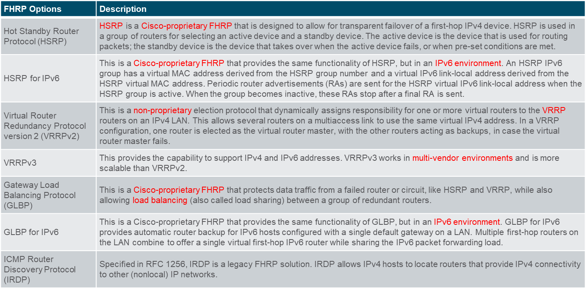
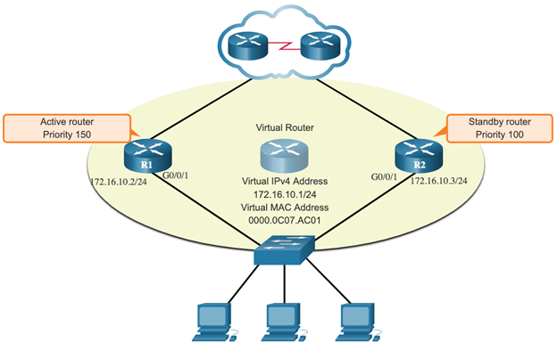
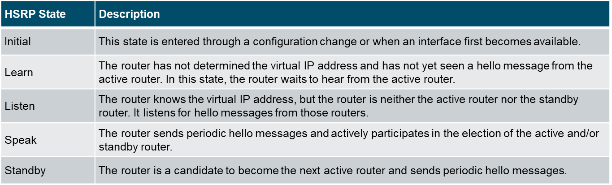

# Module 9: FHRP Concepts

## First Hop Redundancy Protocols

### **1. Default Gateway Limitations**

- End devices are usually configured with a **single IPv4 default gateway** address.
- If the interface associated with the default gateway fails, LAN hosts lose connectivity to external networks, even when redundant network devices are present.
- **First Hop Redundancy Protocols (FHRPs)** address this limitation by enabling alternate default gateways in switched networks.

---

### **2. Router Redundancy**

- **How FHRPs Work:**

  - FHRPs use a **virtual router** to provide a single IP and MAC address for hosts to use as the default gateway.
  - The virtual MAC address gets shared using **Address Resolution Protocol (ARP)**.
  - Hosts communicate with the virtual router, which is represented by multiple physical routers working together.
  - If one router fails, another takes over without disrupting service to hosts.

- **Active Router and Standby Router:**

  - In an FHRP group, the **active router** forwards traffic, while the **standby router** monitors its status and assumes the role if the active router fails.
  - This process is transparent to hosts, ensuring seamless failover.

- **Key Terms:**
  - **First-Hop Redundancy:** The ability to dynamically recover from gateway failures.
  - **Hello Messages:** Used by routers to detect failures and trigger a failover.

1. The standby router stops seeing Hello messages from the forwarding router.
2. The standby router assumes the role of the forwarding router.
3. Because the new forwarding router assumes both the IPv4 and MAC addresses of the virtual router, the host devices see no disruption in service.

## FSRP Overview

### **3. FHRP Options**

FHRPs include several protocols for redundancy. Key ones discussed are:

#### **Hot Standby Router Protocol (HSRP):**

- **Cisco-proprietary protocol** that provides transparent failover for IP hosts configured with a default gateway.
- An HSRP group contains:
  - **Active Router:** Handles traffic.
  - **Standby Router:** Assumes the active role if the active router fails.
- **IPv6 Compatibility:** HSRP supports both IPv4 and IPv6.

---

### **4. HSRP Priority and Preemption**

The role of the active and standby routers in an HSRP group is determined during **the HSRP election process**.

By Default the numerical higher IPv4 address will be the active router.

However control is beter achieved by setting the priority of the routers.

- **Priority:** A value from 0 to 255 that determines the router's role in the HSRP group. -> higher value is better
- Default priority is 100.
- If priorities are equal, the router with the highest IP address becomes the active router.
- By default the router that currently has the active role will not give it up even if the other router has a higher priority.
- **Preemption:** Allows a router with a higher priority to take over the active role. -> standby preempt command

---

### **5. HSRP States and Timers**

HSRP group multicast hello packets to detect failures and trigger failover.

- **HSRP Router States:**
  - Routers exchange **hello packets** at regular intervals.
  - If the standby router does not receive hello packets from the active router within 10 seconds, it assumes the active role.
  - Default timers:
    - Hello: **3 seconds**
    - Hold: **10 seconds**
- **Optimizing Timer Settings:**

  - Lower hello/hold timers for faster failover.
  - Minimum recommended settings:
    - Hello: **1 second**
    - Hold: **4 seconds**
  - Excessive reductions may cause unnecessary state changes or increased CPU usage.

